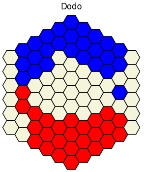
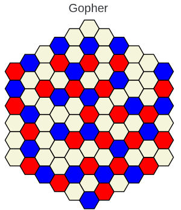
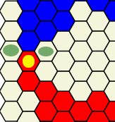

- [Projet UTC IA02 P24](#projet-utc-ia02-p24)
- [Lancer une partie](#lancer-une-partie)
- [I. Fonctionnement : Dodo](#i-fonctionnement-dodo)
  * [A. Environnement](#a-environnement)
  * [B. Évaluations](#b-évaluations)
  * [C. Mémoïsation](#c-mémoïsation)
- [II. Fonctionnement : Gopher](#ii-fonctionnement-gopher)
  * [A. Évaluation](#a-évaluation)
- [III. Fichiers](#iii-fichiers)
- [IV. Quelques résultats en fonction de l'évaluation pour Dodo](#iv-quelques-résultats-en-fonction-de-lévaluation-pour-dodo)
  * [Nombre de coups](#nombre-de-coups)
  * [Pions bloqués](#pions-bloqués)
- [V. Mises à jour](#v-mises-à-jour)


# Projet UTC IA02 P24

[Lien GitLab UTC](https://gitlab.utc.fr/amranial/ia02_projet)

L'objectif de ce projet est de créer des joueurs artificiels de Gopher et de Dodo pour participer à une compétition d'IA. Jeux de Mark Steere dont les règles sont fournis dans le dossier `games`. Dans ce dossier est également présent le sujet de la compétition : [competition.md](games/competition.md).

Mark Steere : marksteeregames.com




# Lancer une partie

**Par serveur** 

1. Installer les dépendances

```bash
pip install -r requirements.txt
```

2. Lancer le serveur (et supprimer le fichier sauvegarde de partie précédente)

```bash
rm config.json server.json;./gndserver-1.0.2-linux -game gopher
```

L'argument après `-game` et le jeu qui sera joué: `gopher` ou `dodo`.

3. Lancer deux clients : 
   
```bash
python3 main.py <id_group> <member_name> <password> 
```

**Sans serveur**

Afin de contrôler le jeu, il est également possible de jouer sans serveur. Dans le fichier `main.py`, fonction `main()`, différent paramètres peuvent être modifié pour contrôler la boucle de jeu

```python
play(<stratégie1: Callable>, <stratégie2: Callable>, <taille du plateau: int>, 
	<'gopher' ou 'dodo'>, 
	<message console: True/False>, 
	<sauvegarde en png du plateau: True/False>
)
```

Une fois ces paramètres fixés, la variable `game` dans `main()` peut être changé en 'dodo' ou 'gopher'.

Puis lancer 

```bash
python3 main.py -ll
```

L'option `-ll` indique un jeu sans serveur via une boucle de jeu, une *local loop*, lancée dans `main()`.

**Changer les stratégies**

Pour changer les stratégies utilisées, il faut inscrire dans `decideur_de_strtategy()` (`main.py`) une fonction stratégie choisie 
parmi celles importées dans les premières lignes de `main.py`.

```python
# Dernière fonction de main.py


def decideur_de_strategy(env:Environment, state:State, player:Player, 
	time_left:Time) -> tuple[Environment, Action]:
    """
    Applique la stratégie appropriée en fonction du jeu.
    """
    if env['jeu'].lower() == 'gopher':
        return strategy_alpha_beta_gopher_actions(env, state, player, time_left)
	# ou autre stratégie de strategies_gopher.py
	# ...

    return strategy_alphabeta_intelligente(env, state, player, time_left)
    # ou une autre stratégie parmi strategies_dodo.py comme :
    return strategy_aleatoire(env, state, player, time_left)
```

Les évaluations peuvent également être modifiée (évoquée plus bas dans [III. Fichiers](#iii-fichiers)).


# I. Fonctionnement Dodo

*Dodo* est un jeu où les coups possibles sont nombreux. Il est donc nécessaire impossible de prévoir tous les coups jusqu'à la fin de partie. 
Une fonction d'évaluation est donc utilisée ainsi qu'un environnement.

## A. Environnement

La cache de l'environnement contient les seuls informations utiles pour le calcul. En nombre restreint, elles permettent de réduire le temps de réponse en réduisant l'arbre de recherche.

Le cache se base sur la notion de *bordures* (mot utilisée à l'origine et conservé - pourrait être maintenant remplacé par *déplaçables*).
Seul les pions qui ne sont pas bloqués, c'est-à-dire qui sont déplaçables, sont gardés dans le cache. Le calcul des coups légaux ne se fait alors que sur ces pions. La profondeur de recherche est alors fonction du nombre de pions déplaçables.

1. `cache`

`Cache` : le cache contient une liste de pions-bordures, tous les pions qui peuvent être déplacés.
C'est une liste de tuple(Cell, Player). Cette liste permet de savoir quels jetons peuvent être déplacés, qui sont donc les jetons qu'il faut regarder pour déterminer les actions légales : un joueur ne peut bouger un jeton que vers l'avant, l'avant-droite ou l'avant-gauche, donc il ne doit rien y avoir devant ce jeton. On l'appellera jeton-bordure. Cette liste contient à la fois les bordures du joueur, et celles de l'adversaire Ainsi, **la recherche d'action se fait parmi cette sélection réduite de jeton.**

Cette liste de jetons-bordures (=jetons-déplaçables) est initialisée lors de la création du plateau.

Puis, lors du calcul des actions, sont calculées pour chaque jetons déplaçables les trois actions possibles (avant ; avant-droite ; avant-gauche). Si aucune des trois actions n'est possibles (`bordure = False` ; par exemple parce que trois jetons adverses sont maintenant devant le jeton), alors le jeton est non déplaçable et est retiré de la liste.

Lorsqu'un jeton est déplaçé, il est également ajouté par défaut à la liste des jetons déplaçables (on fait la supposition qu'aucun jeton ne le bloque dans sa nouvelle position - si c'est le cas, il sera simplement supprimé de la liste lors du calcul des coups possibles - cf. paragraphe précédent). Dans sont déplacement, ce jeton avait peut être d'autres jetons derrière lui, les 3 positions derrières sont donc examinées, et si un jeton y est présent, il est ajouté à la liste des bordures puisqu'il peut maintenant se déplacer.

Exemple : dans l'image ci-dessous, le pions sous le point jaune est considéré comme une bordure/déplaçable car il a deux positions disponibles (les points verts).



2. `cells`

`cells` : dictionnaire de la forme {Cell: Player, Cell:Player, ...}. C'est une version dictionnaire de l'état du jeu `state`. En effet, il n'est pas évident de chercher un élément dans `state` puisque cette liste n'est pas triée. Ainsi, pour savoir si une case est occupée, il faut toutes les parcourir jusqu'à trouver la case recherchée et accéder au deuxième élément du tuple (le joueur). 

Alors qu'avec la version dictionnaire, il suffit, pour savoir si une case est occupée d'appeler `cells[cellule_xy]` qui renverra 0, 1 ou 2 si la case est libre, occupée par joueur rouge ou occupée par joueur bleu. De plus, à partir d'une case xy, pour calculer la case en avant (vers le haut - supposons que nous sommes un joueur rouge) il suffit de faire :

```python
# Prenons une cellule, au hasard, la première, et admettons qu'elle 
# soit au joueur rouge
cellule = state[0]

# L'objectif est de savoir si on peut déplacer cette cellule vers le haut (avant ; tout-droit).

# Il suffit de calculer la nouvelle position => -1 pour les deux coordonnées :

x, y = cellule # récupération des coordonnées de la cellule actuelle

# Construction de la nouvelle postion et récupération de cette cellule.
joueur_devant = cells[ (x-1, y-1) ] 

# Joueur_devant vaut soit 0, soit 1, soit 2.
# Un simple if permet de savoir si nous pouvons nous déplacer devant : 

if joueur_devant == 0:
	# Action possible vers cette case libre
	# ...
```
De plus, `cells` permet de savoir si une cellule existe. Lors du calcul de coups, on ne fait pas de distinction en fonction de la position du jeton. Par exemple, pour le jeton (-6, 0),
on aura trois coup possible : (-5, 0) ; (-5, 1) ; (-6, 1). Or (-6, 1) n'existe pas. Pour éviter de proposer cette case comme action, on vérifie à chaque proposition
d'action si la case proposée est dans le plateau $\Leftrightarrow$ est dans `cells` : `(-6, 1) in cells => False`. 

3. **Autres attributs.**

L'environnement contient également le joueur, le jeu, le numéro du tour, la taille de la grille et un booléan indiquant si le cache de mémoïsation de `alphabeta()` doit être réinitisalisée (en début de partie).

## B. Évaluations

Deux évaluations sont possibles pour dodo.

1. `nb_actions`

L'idée est qu'il vaut mieux aller vers les configurations où l'adversaire à plus de coups à jouer que nous. La différence entre le nombre de coups pour l'un et le nombre de coup pour l'autre est renvoyée.

2. `intelligente` 
   
L'idée est qu'il vaut mieux aller vers les configurations où le nombre de pions bloqués par ses propres pions est supérieur au nombre de pions bloqués par des pions adversaires. Ainsi les déplacements sont "contrôlés", dans la mesure où l'adversaire, en déplaçant un de ses pions, peut engendrer une branche de l'arbre et démultiplier le nombre de coups possibles.

## C. Mémoïsation

Le principe de mémoïsation est utilisée sur les appels à `alphabeta()`, ce qui permet une réduction exceptionnelle du temps de calcule. Cette sauvegarde considère le point de vue d'un joueur, mais également de l'autre joueur : l'état du plateau est recherché dans le cache, et s'il n'y est pas, c'est le plateau retournée de 120° qui est recherché, car une configuration peut apparaître dans les deux sens. Après refléxion sur ce processus, il semblerait qu'il ne soit pas complet dans notre implémentation : il faudrait, en plus de retourner le plateau, changer les valeurs des pions (1 $\leftrightarrow$ 2) car tourner le plateau implique changer le point de vue des joueurs donc changer la valeur des pions. À retravailler donc.

# II. Fonctionnement Gopher

Les coups possibles pour *Gopher* se comptent en nombre limité, borné par le nombre de pions sur le plateau (à une constante près). L'environnement implémenté ne contient donc que le nom du jeu, la taille du plateau, le booléen de re-initialisation du cache de mémoïsation, ainsi que le nombre de pions sur le plateau et les cases invalides.

Ce dernier élément vient de l'idée pour limiter la recherche de coups : les pions ne pouvant être déplacés, une fois qu'il a été jugé qu'une case vide ne pouvait être jouées pour un joueur, elle restera injouable pour ce joueur toute la partie. Les cases "impossibles" sont donc gardés en mémoire pour chaque joueur et non considéré lors du calcul des coups légaux. L'environnement n'ayant pas semblé nécessaire au commencement, deux versions des fonctions sont présentes dans le fichier : avec et sans environnement.

## A. Évaluation

L'évaluation consiste à guider le joueur vers des configurations dans lesquelles le joueur ne peut plus jouer tandis que l'adversaire à encore des coups. La différence du nombre de coups est donc renvoyé, ajoutée à un offset de victoire/défaite si l'un des compteurs de coups est à 0.


# III. Fichiers

- `api.py` : constantes
- `utils.py` : fonctions de conversions, affichage plateau console et en png.
- `main.py` : boucles de jeu, résultats sur 200 parties et connection au serveur.
- `src/`
	- `strategegies_gopher.py` contient les fonctions et utilitaires pour *Gopher*. Trois fonctions de stratégies sont diponibles : aléatoire ; `strategy_alpha_beta_gopher_actions()` utilisant le principe de mémoïsation ; `strategy_alpha_beta_gopher()` sans mémoïsation.
	- `strategies_dodo.py` contient les fonctions de strategies et utilitaires pour *Dodo*
		- `strategy_alphabeta_intelligence()` utilise `evaluation_intelligente()` comme évaluation
		- L'évaluation par nombre de coups est également présente dans ce fichier. Pour l'utiliser il faut remplacer l'appelle de `evaluation_intelligente()` dans `alphabeta()` de *Dodo* par `evaluation_nb_actions()`.

# IV. Quelques résultats en fonction de l'évaluation pour Dodo

Résultats par $\alpha\beta$ avec profondeur fonction du nombre de pions déplaçables.

## Nombre de coups

**Résultat** pour plateau de taille 6.

| Victoire | Nb parties | Commence et Gagne la partie |
|----------|------------|-----------------------------|
| 48       | 100        | 0                           |

- Remarque : si commence $\Rightarrow$ perd.

## Pions bloqués 

**Résultats** pour plateau de taille 6.

- stats du joueur pions bloqués vs nombre de coups :

| Victoire | Nb parties | Commence et Gagne la partie |
|----------|------------|-----------------------------|
| 55       | 100        | ?                           |

- stats du joueur pions bloqués vs. pions bloqué (bon résultats, environ 50-50) :


| joueur | Victoire | Nb parties | Commence et Gagne la partie | Joueur commence |
|--------|----------|------------|-----------------------------|-----------------|
| 1      | 46%      | 30         | 0                           | 13              |
| 2      | 54%      | 30         | 10%                         | 17              |


# V. Mises à jour

- 2024-05-16 : format TP ; fonction init ; api&utils
- 2024-05-18 : print ; boucle jeu ; legals ; fin de jeu ; explications
- 2024-05-26 : évaluation pions bloqués (v1)
- 2024-06-11 : to-do gopher et clean up dodo ; résultats pions bloqués ; refactoring fichiers
- 2024-06-21 : commentaires ; fixes les profondeurs ; détails readme

# To-Do

| Tâches                                                   | Personne | Tout le monde |
|----------------------------------------------------------|----------|---------------|
| Revoir typage `utils.py`                                 |          | fait          |
| Utiliser des constantes comme dans le TP                 |          | fait          |
| Initialisation des pions                                 |          | fait          |
| ---code d'initialisation                                 |          | fait          |
| ---finir init remplir cellules vides                     |          | fait          |
| Calculer les coups possibles                             |          | fait          |
| Jeux aléatoires                                          |          | fait          |
| Si aucun coup possible, le joueur gagne.                 |          | fait          |
| ---score                                                 |          | fait          |
| Mécanisme de tour par tour (fonction jouer)              |          | fait          |
| Evaluation                                               |          | fait          |
| ---pions bloqués                                         |          | fait          |
| ---coupler avec autre chose ?                            |          | fait          |
| **Gopher**                                               | $I$      | fait        |
| ---taille variables                                      | $I$      | fait       |
| ---init le plateau                                       | $I$      | fait       |
| ---évaluation                                            | $I$      | fait       |
| **Dodo**                                                 | $A$      | fait       |
| ---régler la profondeur au 4x4                           | $A$      | fait       |
| ---faire un cas pour taille > 4x4                        | $A$      | fait       |
| **Stratégies**                                           |          | fait       |
| ---supprimer cache de `legals`                           | $A$      | fait       |
| ---prendre en compte le temps (si <10s => `legals()[0]`) | $I$      | fait       |
| **Final**                                                | $I$      | fait      |
| ---désaouller (??)                                       | $I$      | fait       |
| ---reset l'environnement                                 | $I$      | fait       |
| ---reset les fonctions mémoïsation                       | $I$      | fait       |
| ---annoncer le gagnant.                                  | $I$      | fait       |
| **Environnement**                                        | $A$      | fait       |
| ---ajouter taille plateau                                | $A$      | fait       |
| **Clean le code**                                        | $A$      | fait       |
| **Mettre en place le serveur**                           |          | fait       |
| ---tester le client démo                                 |          | fait          |
| ---créer notre client                                    |          | fait          |
| ---vérifier que la fin fonctionne tout le temps          |          | fait       |


