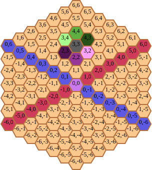
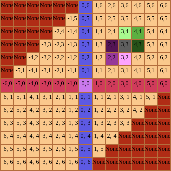

# Projet *Gopher and Dodo* : sujet v1.3

## ChangeLog

- 07/05/2024, v1.3 : changement de l'annotation du type Action pour le rendre compatible avec les versions 3.5 ou plus récentes
- 07/05/2024, v1.2 : correction de coquilles + signature final
- 07/05/2024, v1.1 : ajout des recommendations + correction de coquilles
- 06/05/2024, v1.0 : initiale version

## I. Présentation générale

L'objectif de ce projet est de créer des joueurs artificieles de Gopher et de Dodo capables de jouer à une compétition d'IA. 

Les règles de ces 2 jeux sont fournies sur le moodle de l'UV.

## II. API

```python3
# Types de base utilisés par l'arbitre
Environment = ... # Ensemble des données utiles (cache, état de jeu...) pour
                  # que votre IA puisse jouer (objet, dictionnaire, autre...)
Cell = tuple[int, int]
ActionGopher = Cell
ActionDodo = tuple[Cell, Cell] # case de départ -> case d'arrivée
Action = Union[ActionGopher, ActionDodo]
Player = int # 1 ou 2
State = list[tuple[Cell, Player]] # État du jeu pour la boucle de jeu
Score = int
Time = int
```

Vous devez implémenter les 3 fonctions suivantes permettant à la boucle de jeu de fonctionner.

### Fonction d'initialisation

```python
def initialize(game: str, state: State, player: Player, 
               hex_size: int, total_time: Time) -> Environment
```

Cette fonction est lancée au début du jeu. Elle dit à quel jeu on joue, le joueur que l'on est et renvoie l'environnement, c'est-à-dire la structure de donnée (objet, dictionnaire, etc.) que vous utiliserez pour jouer.


### Fonction de jeu

```python
def strategy(env: Environment, state: State, player: Player,
             time_left: Time) -> tuple[Environment, Action]
```

Cette fonction est la strategie que vous utilisez pour jouer. Cette fonction est lancée à chaque fois que c'est à votre joueur de jouer.

### Resultat de la partie

```python
def final_result(state: State, score: Score, player: Player)
```

Cette fonction est appelée à la fin du jeu et revoie le joueur gagnant, l'état final et le score.

## III. Représentation des cases





## IV. Travail demandé et consignes

### Jalon

- **vendredi 10 mai, 23h59 :** choix des binômes
- **vendredi 21 juin :** compétition finale d'IA
- **vendredi 21 juin, 23h59 :** dépôt des sources

### Déroulement de la compétition

- Chaque joueur possède un temps de jeu global individuel par match (comme une horloge dans les parties d'échec)
- En cas de coup illegal, le serveur selectionnera la première action disponible
- Lors d'une confrontation il y aura deux matchs: un en temps que joueur 1 et l'autre en temps que joueur 2

### Divers

- Le projet doit être écrit en Python 3
- Le projet doit être réalisé en binômes d'un même TP

### Code fourni

- La boucle de jeu sera fournie
- La partie réseau vous sera fournie

### Quelqures recommandations

- Les TP sont une bonnes base de départ...

## FAQ
